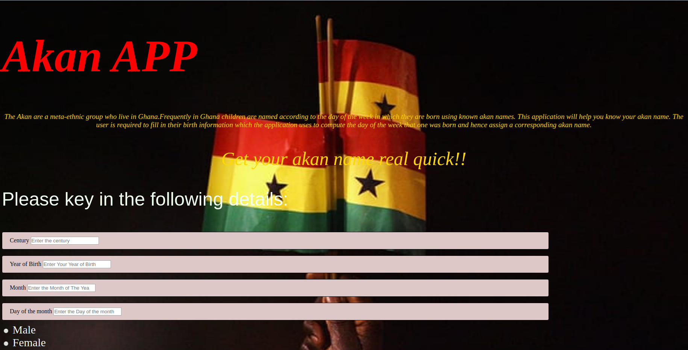

# AKAN APP
#### 
#### By Emmanuel Nakitare
## Description
The Akan is a user-friendly application whose main specialty is enabling a user determine the day of the week in which they were born. The app prompts the user to key in their birth details such as the century in which they were born, the year of birth, the month of birth and the day of the month in which they were born. It then uses this information with the help of a predifined function to return the day of the week in which one was born.
## Screenshot

## Setup/Installation Requirements
If using ubuntu OS code sudo apt install ./akan app.deb.
## Known Bugs
This app may not display the result in some devices.
## Technologies Used
HTML
CSS
Bootstrap
Javascript
## Support and contact details

### License
MIT License
Copyright (c) 2020 ****